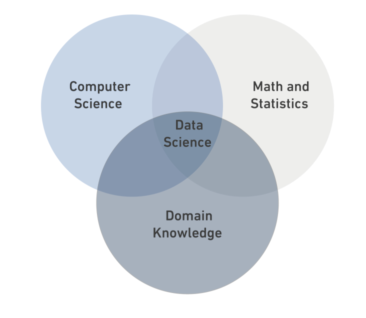

# Data Science

## What is Data Science?

### Data Types

**Data Science** is a *multidisciplinary field* that combines statistics, computer science, and domain knowledge.




Data types:

* Structured Data
* Semi-Structured
* Unstructured

 

| Structured Data| Semi-Structured| Unstructured|
|:------------|:------------:|:------------:|
| it is data that has been organized into a strict schema.| it is data that does not conform to a schema but has some structure. | it is data that has no schema.|
| e.g: tables| e.g: xml| e.g: photos|

```
print ("DS Bootcamp")
```


[Read More](https://en.wikipedia.org/wiki/Data_science)
